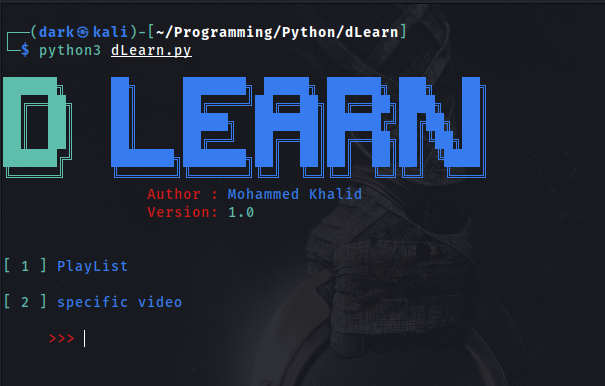
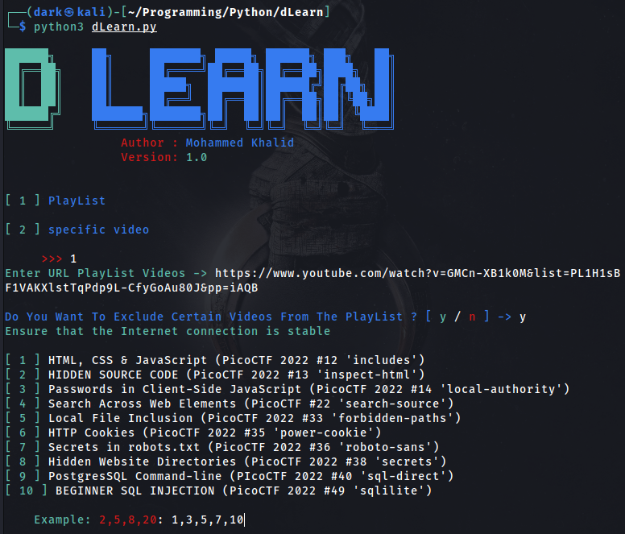
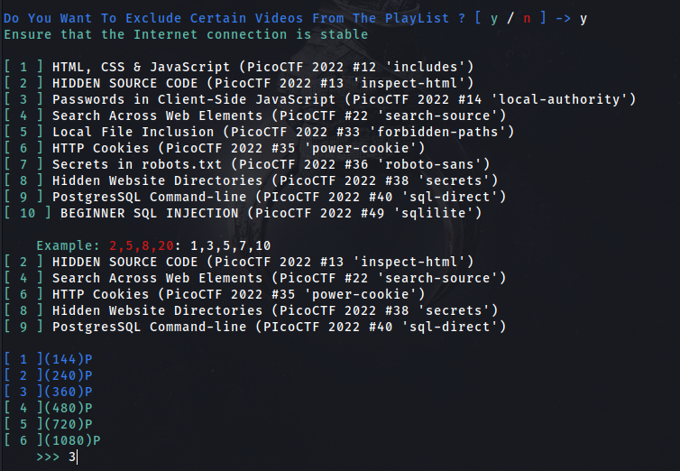
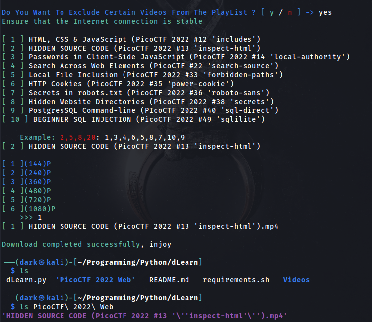
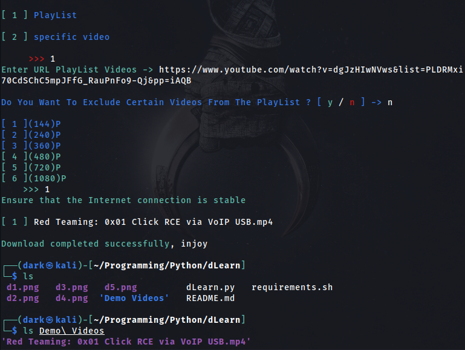
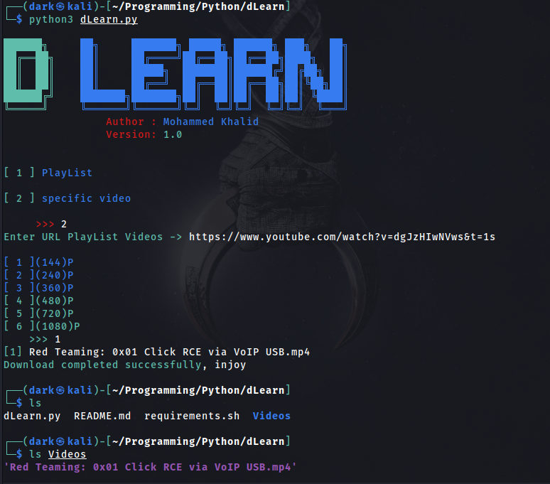
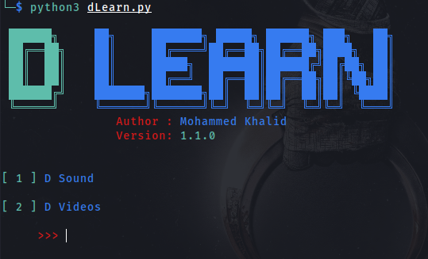
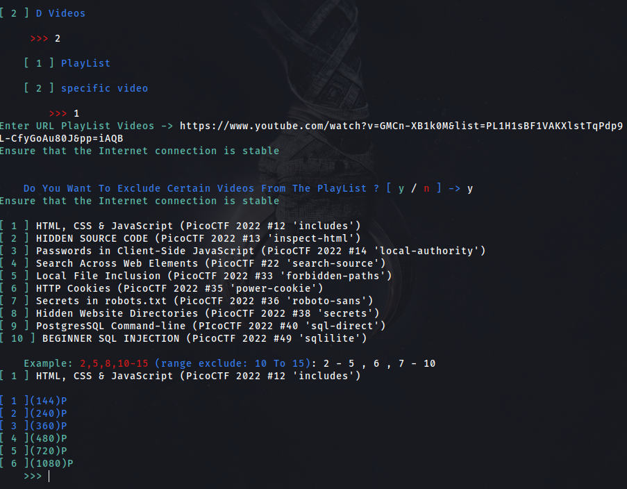
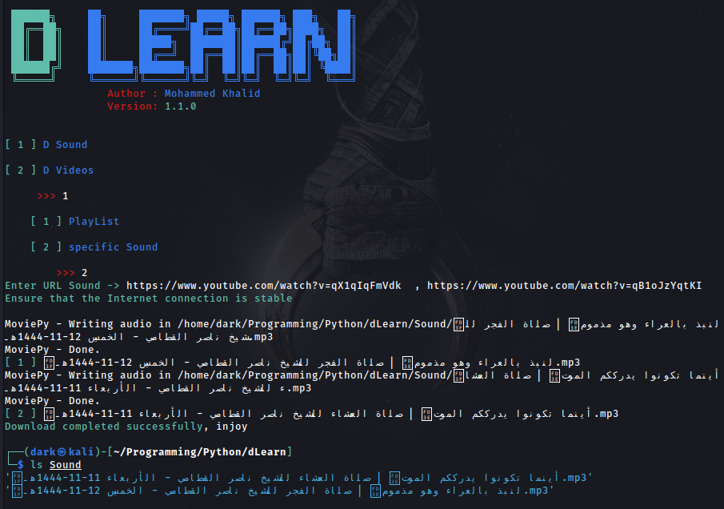

# dLearn

**dLearn** : The d Learn tool downloads the lists and educational videos that you aspire to learn 
from **YouTube** (this is its main goal)
It saves you the trouble of going to sites that may be suspicious, as it saves you time and effort


## Features
*	You can exclude certain videos from playlists, to suit your need
*	You can download the videos in the quality you want
*	You can download a specific video (Case 1)

## Upcoming updates
- [ ]   More than one other quality will be added to the videos
- [ ]  console user interface (CLI) will be supported , To be able to enter parameters faster
- [ ]   You can compress files
- [ ]   Download videos from other sources (Udemy , Mega)
- [x]   Convert videos to music (MP3)
- [x]    And More ...
- [x]    Things that make it easier for users

  


## Installation
Download dLearn by cloning the Git repository:
<br />```$ git clone https://github.com/Dark-Night0/dLearn.git```
<br />```$ pip install -r requirements.txt```

## Usage
<br />```$ python3 dLearn.py```

<br />


* **Click the arrow **( Old Version )** to see the old update**
<details>
<summary> Old Version</summary>

<br/>

---
***
___

## **Demo Old Version**
  
[](https://asciinema.org/a/ykYIE5uQSVMRs4WcbKXnqAKdT)

---
***
___


<br/>

## Images
<br/>



---
***
___
## Cases (YouTube)
* **Case 1 (Exclude certain videos)**


<br />
<br />



<br />

---
***
___

# OR


<br />

---
***
___

* **Case 2 (Videos are not excluded)**

<br />

---
***
___

* **Case 3 (Download a specific video)**

<br />
<br />

</details>
<br />

## New Version **1.1.0**
<br/>



***

* The ring was added to make it easier for the user to exclude more things in an easier way **(mini -  max)**


<br/>
***
* Now you can easily download audio (mp3) clips from YouTube 
  


---
***
## **Demo**
<br />

[](https://asciinema.org/a/GGzUm7uRUPYDCSvmGuIP2IP6Y)

<br />

---
***
___

## Author

Mohammed Khalid (0xDARK)
<br />

## Contacts
 **Facebook** 
* [Mohammed Khalid](https://www.facebook.com/profile.php?id=100085121092587)

 **Twitter** 
* [0xDARK3](https://twitter.com/0xDARK3)

 **Linkedin** 
* [Mohammed Khalid](https://www.linkedin.com/in/mohammed-khalid-3b43a51b3?fbclid=IwAR0LdK7KAb_etFC8qdXQBg-9ApWOfxNZHY1CwuVUe52AgpycPZcdUU9-pt0)

<br>

 **Medium** 
* [0xDARK](https://medium.com/@0xDARK)
